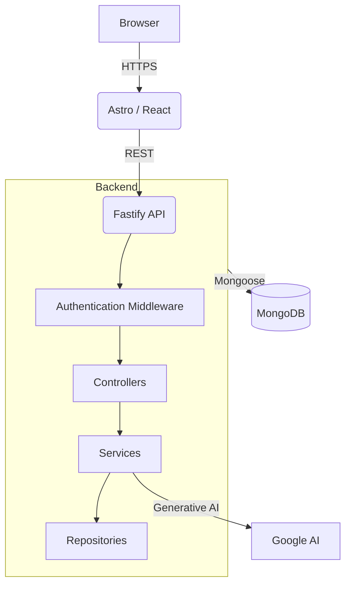

# ÆSoul / CodeForge

A full-stack, production-ready portfolio and administrative platform designed to demonstrate modern software engineering practices.

> **Target:** A cohesive showcase of architecture, security, performance, and automation.

## 🚀 Live Demo
https://www.aesoul0.com

## 📸 Screenshots
*(Insert Screenshots of Homepage, Project Page, Admin Dashboard, API Playground)*

## 🏗️ Architecture



## ✨ Features
- **Highly Optimized UI**: Built with Astro and Tailwind CSS.
- **Admin Dashboard**: Full CRUD management of projects and experiences.
- **API Playground**: Test all endpoints directly within the authenticated dashboard.
- **AI Content Enrichment**: Automatically generates rich project descriptions.

## 🛠️ Tech Stack
- **Frontend**: Astro, React, Tailwind CSS, TypeScript
- **Backend**: Node.js, Fastify, TypeScript, Mongoose
- **Database**: MongoDB Atlas
- **Testing**: Vitest, Supertest

## 🔐 Security
- Fully configured CSP, Helmet, and CORS.
- Route-specific and global rate limiting.
- JWT authentication with secure, HttpOnly, SameSite cookies.
- No sensitive data exposed in the frontend or unauthenticated routes.

## 🧪 Testing
- Backend unit and integration tests built with Vitest.
- E2E testing strategy using Playwright.
- Test coverage targeting >85%.

## ⚡ Performance
- Dynamic Particle Canvas heavily optimized with `IntersectionObserver`, `requestAnimationFrame`, and `prefers-reduced-motion` adaptations.
- Zero-JS Astro islands wherever possible.

## 🤖 CI/CD
Automated pipeline ensuring:
- Code linting and TypeScript typechecking
- Unit and integration tests
- CodeQL and Dependency audits

## 🏃 Local Development

```bash
# Clone the repository
git clone https://github.com/Aesoul/CodeForge.git

# Install dependencies
cd CodeForge
cd frontend && npm install
cd ../backend && npm install

# Start Backend
cd backend
npm run dev

# Start Frontend
cd frontend
npm run dev
```

## 📜 License
&copy; 2026 ÆSoul. All rights reserved.
This project and its source code are proprietary and belong exclusively to ÆSoul. Unauthorized copying, modification, or distribution is strictly prohibited.
