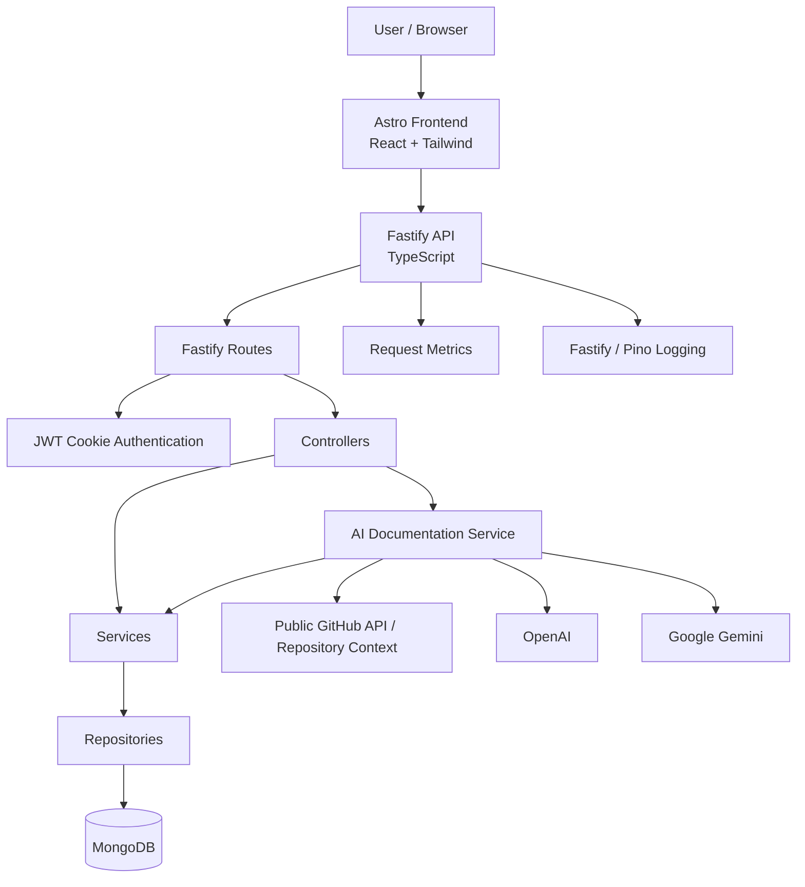
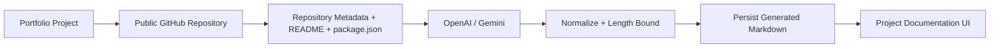
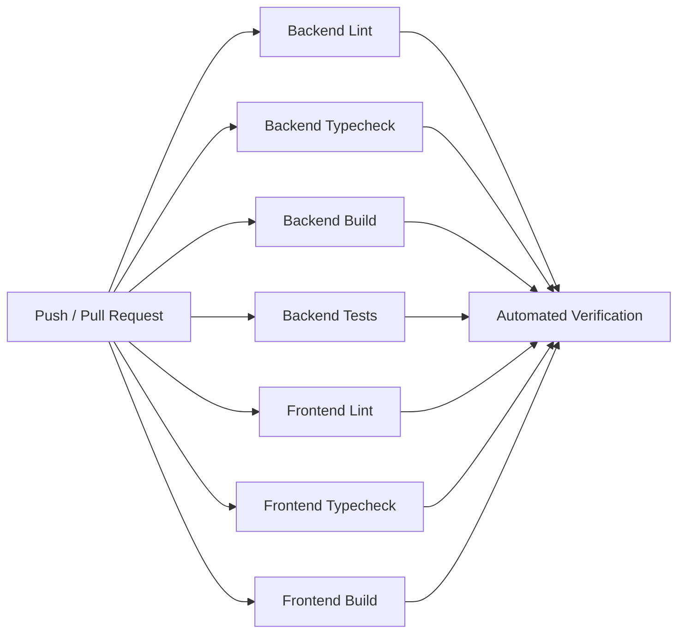

# CodeForge

**A performance-oriented full-stack portfolio platform built with Astro, Fastify, MongoDB, and an AI-assisted documentation pipeline grounded in public GitHub repository context.**

[](https://github.com/AeSoul0/CodeForge/actions/workflows/ci.yml)


## Overview

CodeForge is a personal portfolio platform implemented as a split frontend/backend system. It combines an Astro-based web application with a Fastify API, MongoDB persistence through Mongoose, protected administrative workflows, automated project documentation, and a small in-process observability layer.

The repository is designed to demonstrate practical engineering rather than only present a visual portfolio. The codebase includes explicit separation between HTTP configuration and server startup, Controller → Service → Repository backend layers, schema validation at API boundaries, security middleware, automated backend testing, Docker definitions, and GitHub Actions verification.

The portfolio currently manages two primary content domains:

* **Projects** — public portfolio entries with technology metadata, GitHub links, images, and long-form documentation.
* **Experiences** — professional experience records with optional images stored in MongoDB.

Administrative operations are protected by JWT authentication using an HTTP-only cookie. Project creation and explicit regeneration can trigger an asynchronous AI documentation workflow that collects public GitHub repository context and persists generated Markdown.

The repository also contains supporting architecture, API, security, deployment, testing, and engineering-evidence documentation under [`docs/`](docs/).

## Problem

A software portfolio has to solve two different problems at once:

1. Present projects and experience through a fast, accessible public interface.
2. Provide a maintainable administrative system for updating portfolio data without hard-coding content into the frontend.

A second problem appears as project complexity grows: a portfolio description can become too shallow to communicate architecture, design decisions, security controls, or implementation details.

CodeForge addresses these concerns by separating presentation from portfolio management and by treating generated technical documentation as a data-processing workflow rather than as static marketing copy.

## Solution

CodeForge uses a dedicated Fastify API and MongoDB persistence behind an Astro frontend.

The backend exposes public read operations for portfolio content and protected administrative operations for mutation. Data access is isolated behind repositories, business orchestration sits in services, and controllers translate HTTP requests into application operations.

For AI-assisted documentation, CodeForge can inspect public GitHub repository metadata, the repository README, and `package.json` when available. That context is supplied to either an OpenAI or Gemini provider, with explicit instructions not to invent unsupported technologies or architectural details. Generated output is normalized, bounded, persisted, and rendered by the portfolio application.

## 🚀 Engineering Highlights

| Area             | Implementation                                                      | Engineering Goal                                                                        |
| ---------------- | ------------------------------------------------------------------- | --------------------------------------------------------------------------------------- |
| Frontend         | Astro + React integration + Tailwind CSS                            | Keep the UI lightweight while retaining component-level interactivity                   |
| Backend          | Fastify + TypeScript                                                | Explicit HTTP boundaries and a strongly typed application layer                         |
| Architecture     | Controller → Service → Repository                                   | Separate transport, business logic, and persistence responsibilities                    |
| Persistence      | MongoDB + Mongoose                                                  | Document-based portfolio storage with model and validation support                      |
| Security         | Helmet, CSP, HSTS, CORS, JWT, secure cookies, bcrypt, rate limiting | Reduce common web attack surface around the administrative API                          |
| API validation   | Fastify JSON schemas                                                | Reject malformed or unexpected request payloads at the HTTP boundary                    |
| Testing          | Vitest + Supertest                                                  | Unit and HTTP-level regression coverage for the backend                                 |
| Containers       | Docker + Docker Compose                                             | Reproducible local multi-service environments                                           |
| CI               | GitHub Actions                                                      | Automated linting, typechecking, builds, and backend tests                              |
| Observability    | Fastify logging + in-process request metrics                        | Runtime visibility into requests, status classes, latency, and database state           |
| AI documentation | GitHub context + OpenAI/Gemini + persisted Markdown                 | Generate repository-aware technical documentation without relying on unsupported claims |
| Accessibility    | Semantic markup, ARIA usage, focus handling, reduced-motion support | Improve baseline accessibility without claiming formal WCAG compliance                  |

## Key Features

### Frontend

* Astro application with React integration.
* Tailwind CSS styling.
* Project detail pages under `projects/[slug].astro`.
* Portfolio sections for projects, experience, competencies, navigation, and footer.
* A particle/canvas visual component implemented in Astro.
* Public SEO assets including `robots.txt` and `sitemap.xml`.
* Vercel adapter configuration.
* Frontend health endpoint at `/api/health`.

### Backend

* Fastify 5 with TypeScript.
* MongoDB persistence through Mongoose.
* Public project and experience read APIs.
* Protected create, update, delete, and AI-regeneration operations.
* Swagger UI at `/api-docs`.
* Explicit liveness and readiness endpoints.
* Global error handling with mapped validation, duplicate-key, ID, and application errors.
* Graceful shutdown handling for Fastify and MongoDB.

### Security

* `@fastify/helmet` with CSP, HSTS, frameguard, referrer policy, and cross-origin resource policy configuration.
* Restricted CORS origins with credentials enabled.
* Global request rate limiting of 100 requests per minute per IP.
* A stricter login rate limit of 5 attempts per minute.
* JWT authentication backed by an environment-provided secret.
* JWT stored in an HTTP-only cookie with `SameSite=Strict` and `Secure` enabled in production.
* bcrypt password hashing.
* Development authentication bypass explicitly gated by `NODE_ENV=development`.
* Fastify JSON schema validation with `additionalProperties: false` on major mutation routes.
* Production error responses avoid exposing stack traces and internal details.

### Testing and Quality

* Vitest test runner.
* Supertest integration testing.
* V8 coverage support.
* ESLint.
* TypeScript typechecking.
* Automated backend build.
* GitHub Actions CI for backend and frontend checks.

## Architecture

CodeForge uses a split frontend/backend architecture with explicit separation between the Fastify application factory and the actual server bootstrap.



### Frontend

The frontend is configured in [`frontend/astro.config.mjs`](frontend/astro.config.mjs) with:

* Astro;
* React integration;
* Tailwind CSS through the Vite plugin;
* Vercel adapter;
* server output mode;
* development server on port `2003`.

The frontend contains the portfolio page, project detail pages, reusable Astro components, styling, public assets, and a small React component used for backend interaction.

### Backend

The Fastify application is created in [`backend/src/app.ts`](backend/src/app.ts), while server startup is isolated in [`backend/src/index.ts`](backend/src/index.ts).

This separation is intentional: tests can import the configured Fastify application without opening a network listener or performing the production bootstrap sequence.

The backend startup sequence is:

1. Connect to MongoDB.
2. Seed the initial administrator when applicable.
3. Wait for Fastify application initialization.
4. Start the HTTP server.
5. Launch missing AI documentation generation asynchronously.
6. Handle `SIGINT` and `SIGTERM` with graceful shutdown.

### Data Flow

For normal administrative operations:

```text
HTTP Request
    ↓
Fastify Route
    ↓
Authentication / Validation
    ↓
Controller
    ↓
Service
    ↓
Repository
    ↓
Mongoose / MongoDB
```

The service layer maps persistence objects into API DTOs before returning them to the HTTP layer.

## Architecture Principles

### Separation of concerns

HTTP configuration, business logic, persistence, and server startup are intentionally separated. Controllers handle HTTP concerns, services coordinate application behavior, and repositories encapsulate MongoDB access.

### Explicit boundaries

Fastify routes apply request schemas and authentication before protected operations reach controller code.

### Environment-driven configuration

Database connections, authentication secrets, allowed frontend origins, and AI credentials are provided through environment variables rather than hard-coded application configuration.

### Secure-by-default administrative access

Administrative mutations require JWT authentication. The only authentication bypass path is explicitly limited to development environments through `DEV_BYPASS_AUTH=true`.

### Evidence over marketing

The repository distinguishes between implemented controls, verified checks, and metrics that have not yet been measured. Performance scores, accessibility compliance, and coverage percentages are not published as facts without current measurement.

## Project Structure

```text
CodeForge/
├── .github/
│   ├── dependabot.yml
│   └── workflows/
│       └── ci.yml
├── backend/
│   ├── src/
│   │   ├── config/
│   │   ├── controllers/
│   │   ├── dtos/
│   │   ├── errors/
│   │   ├── middlewares/
│   │   ├── models/
│   │   ├── repositories/
│   │   ├── routes/
│   │   ├── services/
│   │   └── utils/
│   ├── tests/
│   │   ├── api/
│   │   └── unit/
│   ├── Dockerfile
│   ├── package.json
│   ├── tsconfig.json
│   └── vitest.config.ts
├── docs/
│   ├── architecture.md
│   ├── api.md
│   ├── deployment.md
│   ├── evidence.md
│   ├── security.md
│   └── testing.md
├── frontend/
│   ├── public/
│   ├── src/
│   │   ├── components/
│   │   ├── layout/
│   │   ├── pages/
│   │   └── styles/
│   ├── Dockerfile
│   ├── astro.config.mjs
│   └── package.json
├── .env.example
├── docker-compose.yml
├── package.json
└── README.md
```

### Important directories

| Path                       | Responsibility                                                               |
| -------------------------- | ---------------------------------------------------------------------------- |
| `frontend/src/pages`       | Public Astro routes, project pages, and frontend health endpoint             |
| `frontend/src/components`  | Reusable portfolio UI components                                             |
| `frontend/src/layout`      | Shared page/layout structure                                                 |
| `backend/src/routes`       | Fastify route definitions and request schemas                                |
| `backend/src/controllers`  | HTTP request/response handling                                               |
| `backend/src/services`     | Business logic and orchestration                                             |
| `backend/src/repositories` | MongoDB/Mongoose persistence abstraction                                     |
| `backend/src/models`       | Mongoose models                                                              |
| `backend/src/middlewares`  | Authentication, error handling, and request metrics                          |
| `backend/src/utils`        | AI generation, audit logging, admin seeding, deployment helpers              |
| `backend/tests`            | Backend unit and HTTP integration tests                                      |
| `docs`                     | Architecture, API, security, deployment, testing, and evidence documentation |

## Technology Stack

| Layer             | Technology                      | Role                                        |
| ----------------- | ------------------------------- | ------------------------------------------- |
| Frontend          | Astro 7                         | Web application and routing                 |
| Frontend UI       | React 19                        | Component integration where needed          |
| Styling           | Tailwind CSS 4                  | Styling system                              |
| Frontend adapter  | `@astrojs/vercel`               | Vercel deployment integration               |
| Backend           | Fastify 5                       | REST API server                             |
| Language          | TypeScript 6                    | Application code                            |
| Runtime           | Node.js 22.12+                  | Backend and build runtime                   |
| Database          | MongoDB                         | Persistence                                 |
| ODM               | Mongoose 9                      | MongoDB models and access                   |
| Authentication    | `@fastify/jwt` + cookies        | Administrator authentication                |
| Password hashing  | bcrypt 6                        | Password hashing                            |
| Security          | Helmet, CORS, rate limit        | HTTP security controls                      |
| API documentation | `@fastify/swagger` / Swagger UI | OpenAPI-style interactive API documentation |
| Testing           | Vitest / Supertest              | Automated backend verification              |
| Coverage          | `@vitest/coverage-v8`           | V8-based coverage reporting                 |
| Linting           | ESLint                          | Static code quality checks                  |
| Containers        | Docker / Docker Compose         | Local multi-service orchestration           |
| CI                | GitHub Actions                  | Automated repository checks                 |
| AI providers      | OpenAI / Gemini                 | Technical documentation generation          |

## Setup & Installation

### Prerequisites

The repository currently targets:

* Node.js `22.12.0` or newer.
* npm.
* MongoDB for local non-containerized backend development, or Docker for Compose-based development.
* Docker and Docker Compose for the containerized workflow.

The repository also contains `.nvmrc` for Node version alignment.

### Clone

```bash
git clone https://github.com/AeSoul0/CodeForge.git
cd CodeForge
```

### Environment setup

The root [`.env.example`](.env.example) documents the backend/Compose configuration variables:

```dotenv
NODE_ENV=development
PORT=3000

MONGODB_URI=mongodb://localhost:27017/codeforge_db

ADMIN_API_KEY=your_secure_admin_api_key_here
JWT_SECRET=your_jwt_secret_key_here

FRONTEND_URL=http://localhost:4321
```

For local backend development, create `backend/.env` from the example values and configure the environment for the backend process.

For Docker Compose, create a root `.env` because `docker-compose.yml` loads `.env` at the repository root.

AI features are optional at runtime. The backend can use:

* `OPENAI_API_KEY`
* `OPENAI_MODEL`
* `GEMINI_API_KEY`
* `GEMINI_MODEL`

A `GITHUB_TOKEN` is also supported to increase GitHub API rate limits when collecting public repository context.

Never commit real credentials.

### Docker Compose

The repository includes a local development Compose stack for MongoDB, the Fastify backend, and the frontend container:

```bash
docker-compose up --build
```

The configured local ports are:

| Service            |    Port |
| ------------------ | ------: |
| Frontend container |  `4321` |
| Backend API        |  `3000` |
| MongoDB            | `27017` |

To run detached:

```bash
docker-compose up --build -d
```

### Local development

Backend:

```bash
cd backend
npm install
npm run dev
```

Backend build:

```bash
npm run build
```

Backend production start:

```bash
npm start
```

Frontend:

```bash
cd frontend
npm install
npm run dev
```

Frontend production build:

```bash
npm run build
```

Frontend preview:

```bash
npm run preview
```

## Configuration

| Variable          | Scope             | Required | Purpose                                                   | Safe example                             |
| ----------------- | ----------------- | -------- | --------------------------------------------------------- | ---------------------------------------- |
| `NODE_ENV`        | Backend / Compose | Yes      | Runtime environment                                       | `development`                            |
| `PORT`            | Backend / Compose | Yes      | Fastify HTTP port                                         | `3000`                                   |
| `MONGODB_URI`     | Backend / Compose | Yes      | MongoDB connection string                                 | `mongodb://localhost:27017/codeforge_db` |
| `JWT_SECRET`      | Backend           | Yes      | JWT signing secret                                        | `your_jwt_secret_here`                   |
| `ADMIN_API_KEY`   | Backend           | Yes      | Administrator bootstrap credential                        | `your_admin_api_key_here`                |
| `FRONTEND_URL`    | Backend / Compose | Yes      | Trusted frontend origin used by CORS/CSP                  | `http://localhost:4321`                  |
| `DEV_BYPASS_AUTH` | Backend           | No       | Development-only auth bypass                              | `false`                                  |
| `OPENAI_API_KEY`  | Backend           | No       | Enables OpenAI documentation generation                   | `your_openai_key_here`                   |
| `OPENAI_MODEL`    | Backend           | No       | OpenAI model override                                     | `gpt-4o-mini`                            |
| `GEMINI_API_KEY`  | Backend           | No       | Enables Gemini documentation generation                   | `your_gemini_key_here`                   |
| `GEMINI_MODEL`    | Backend           | No       | Gemini model override                                     | `your_gemini_model_here`                 |
| `GITHUB_TOKEN`    | Backend           | No       | Optional GitHub API authentication for higher rate limits | `your_github_token_here`                 |

No frontend secret is documented by the repository as a required build-time credential. Public client configuration should not contain server-side secrets.

## Usage

### Public application

The repository identifies the public portfolio at:

**https://www.aesoul0.com**

The frontend exposes project and experience content through the public UI.

### Backend API

The local backend is configured around port `3000` in Compose. The Fastify application itself defaults to port `3002` when `PORT` is not set, while the provided environment and Compose configuration explicitly use `3000`.

Swagger UI is available at:

```text
/api-docs
```

### Example: read projects

```bash
curl http://localhost:3000/api/projects
```

Pagination parameters are supported:

```bash
curl "http://localhost:3000/api/projects?page=1&limit=10"
```

### Example: administrator login

```bash
curl -i \
  -c cookies.txt \
  -H "Content-Type: application/json" \
  -d '{"username":"admin","password":"your_password"}' \
  http://localhost:3000/api/auth/login
```

The successful login response sets the `token` HTTP-only cookie.

### Example: authenticated project mutation

```bash
curl -i \
  -b cookies.txt \
  -H "Content-Type: application/json" \
  -X PATCH \
  -d '{"descrizione":"Updated project description"}' \
  http://localhost:3000/api/projects/<project-id>
```

## API

The API is organized into authentication, projects, experiences, and health/observability endpoints.

### Health and observability

| Method | Endpoint   | Purpose                                                  |
| ------ | ---------- | -------------------------------------------------------- |
| `GET`  | `/live`    | Process liveness                                         |
| `GET`  | `/ready`   | Dependency/readiness status                              |
| `GET`  | `/metrics` | In-process request metrics and database connection state |

### Authentication

| Method | Endpoint           | Access |
| ------ | ------------------ | ------ |
| `POST` | `/api/auth/login`  | Public |
| `POST` | `/api/auth/logout` | Public |

Login is rate-limited to 5 requests per minute and stores the JWT in the `token` HTTP-only cookie.

### Projects

| Method   | Endpoint                        | Access |
| -------- | ------------------------------- | ------ |
| `GET`    | `/api/projects`                 | Public |
| `POST`   | `/api/projects`                 | Admin  |
| `PATCH`  | `/api/projects/:id`             | Admin  |
| `DELETE` | `/api/projects/:id`             | Admin  |
| `POST`   | `/api/projects/:id/generate-ai` | Admin  |

Project listing supports pagination. The repository layer caps the effective page size at 50 items.

Project creation and explicit AI regeneration run the documentation workflow asynchronously.

### Experiences

| Method   | Endpoint                     | Access |
| -------- | ---------------------------- | ------ |
| `GET`    | `/api/experiences`           | Public |
| `GET`    | `/api/experiences/:id/image` | Public |
| `POST`   | `/api/experiences`           | Admin  |
| `PATCH`  | `/api/experiences/:id`       | Admin  |
| `PATCH`  | `/api/experiences/:id/image` | Admin  |
| `DELETE` | `/api/experiences/:id`       | Admin  |

Experience image uploads accept Base64 data URIs for JPEG, PNG, and WebP. The decoded image is limited to 8 MB and stored as binary data in MongoDB. Responses use a dedicated image endpoint rather than returning the Base64 payload in normal experience objects.

### Error handling

The global Fastify error handler maps common failures to structured responses, including:

* validation failures;
* invalid MongoDB identifiers;
* duplicate keys;
* application-level errors;
* unexpected server errors.

Production responses intentionally avoid exposing stack traces and internal error details.

## 🤖 AI-Assisted Documentation

CodeForge contains an implemented AI documentation pipeline for portfolio projects.

The workflow is designed around repository context rather than unconstrained text generation.

### Workflow

1. An administrator creates a project or explicitly requests documentation regeneration.
2. CodeForge parses the configured GitHub repository URL.
3. Public GitHub repository metadata is collected.
4. The repository README is fetched when available.
5. `package.json` is fetched from the repository's default branch when available.
6. The gathered context is truncated to bounded sizes before being inserted into the generation prompt.
7. OpenAI is attempted first when `OPENAI_API_KEY` is configured.
8. Gemini is attempted when configured and OpenAI is unavailable or fails.
9. Generated Markdown is normalized and limited to a maximum generated size.
10. The resulting documentation is persisted with the project.
11. The background operation can trigger the configured Vercel deployment helper after successful persistence.



### Grounding rules

The generation prompt explicitly instructs the model to:

* avoid inventing frameworks, databases, cloud services, modules, or patterns;
* distinguish observed facts from reasonable inferences;
* describe only what can be supported by the supplied context;
* prefer concrete technical explanations over generic marketing language.

The implementation also caps repository context at 16,000 characters per relevant source and generated output at 45,000 characters.

### Provider configuration

OpenAI has priority when `OPENAI_API_KEY` is present. Gemini can act as a fallback provider.

AI generation is optional. The backend remains capable of serving the API without an AI provider configured; AI-specific background operations fail with an explicit configuration error rather than silently producing fabricated content.

## 🔐 Security

CodeForge implements multiple application-level controls around the administrative API.

### HTTP hardening

Fastify Helmet is configured with:

* Content Security Policy;
* HSTS with subdomains and preload;
* frame denial;
* strict-origin-when-cross-origin referrer policy;
* cross-origin resource policy;
* a restrictive Permissions-Policy header.

The CSP permits only the application origin by default, with explicit allowances for image and frontend connection behavior.

### CORS

CORS is restricted to configured frontend origins and the repository's documented local development origins. Credentials are enabled because administrator authentication relies on cookies.

### Rate limiting

A global rate limit of **100 requests per minute** is configured per IP.

The administrator login endpoint applies a stricter **5 requests per minute** limit.

### Authentication

Administrative endpoints use Fastify JWT verification.

The JWT is delivered in the `token` cookie with:

```text
HttpOnly: true
SameSite: Strict
Secure: true in production
```

The configured maximum cookie lifetime is one day.

A development bypass is present for local workflows, but it requires both:

```text
NODE_ENV=development
DEV_BYPASS_AUTH=true
```

The code path therefore cannot activate solely by setting the bypass flag in a production environment.

### Password protection

Administrator credentials are validated through a service/repository flow and passwords are hashed using bcrypt.

### Input validation

Project and experience mutation endpoints use Fastify JSON schemas with:

* explicit required fields;
* type checking;
* minimum and maximum lengths;
* array item limits;
* maximum array sizes;
* `additionalProperties: false`;
* identifier format checks;
* controlled image MIME types and payload sizes.

### Error disclosure

The production error handler suppresses stack traces and internal exception details. Development responses may include more diagnostic information.

### Container hardening

Both application containers are configured to run as non-root users:

* backend: `node`;
* frontend: `nginx`.

The images use Alpine-based runtimes.

## Security Considerations

The repository implements practical application security controls but does not claim complete security assurance.

Areas that still require deployment-specific hardening include:

* external secret management and secret rotation;
* infrastructure-level TLS termination;
* centralized audit log storage;
* broader abuse detection beyond request rate limiting;
* formal CSRF assessment of all authenticated mutation flows;
* production incident response and alerting;
* ongoing dependency and platform security review.

Security controls implemented in source code should therefore be treated as an application baseline, not as a guarantee of security in every deployment.

## ⚡ Performance

CodeForge is designed with performance-oriented decisions, but the repository does not currently publish a fresh benchmark or Lighthouse measurement.

### Implemented decisions

* Astro is used for the frontend rather than a client-heavy single-page application framework.
* The frontend contains primarily Astro components with React integration used selectively.
* Backend requests pass through a layered Fastify architecture rather than a monolithic route implementation.
* Project listing is paginated and repository queries cap the effective page size at 50.
* Experience images are served through a dedicated endpoint and include browser cache headers.
* AI documentation is generated asynchronously so expensive provider calls do not block the initiating HTTP request.
* Fastify connection and keep-alive timeouts are explicitly configured.

### Not currently measured

The repository does not currently provide a fresh, reproducible measurement for:

* Lighthouse performance score;
* Core Web Vitals;
* p95/p99 API latency;
* throughput;
* sustained concurrent load;
* database query performance under production traffic.

No numerical performance claim should be inferred from the architecture alone.

## ♿ Accessibility

The frontend contains implementation choices intended to improve accessibility, including semantic HTML, ARIA usage where appropriate, focus handling, and reduced-motion support.

These are implementation-level signals, not proof of formal conformance.

The repository does **not** currently claim verified WCAG 2.2 AA compliance. A formal accessibility assessment would still require automated and manual checks such as:

* Lighthouse;
* axe;
* keyboard-only navigation;
* focus visibility;
* screen-reader validation;
* reduced-motion verification.

## 🧪 Testing

The backend uses:

* **Vitest** for unit and test-suite execution;
* **Supertest** for HTTP-level integration testing;
* **V8 coverage** for coverage reporting.

### Test commands

Run the suite:

```bash
cd backend
npm test
```

Run tests in watch mode:

```bash
npm run test:watch
```

Generate coverage:

```bash
npm run test:cov
```

Typecheck:

```bash
npm run typecheck
```

Lint:

```bash
npm run lint
```

Build:

```bash
npm run build
```

The current repository contains two backend test files:

```text
backend/tests/unit/ProjectService.test.ts
backend/tests/api/project.test.ts
```

## ✅ Engineering Evidence

CodeForge deliberately separates **Implemented**, **Verified**, and **Measured** evidence.

| Signal                   | Status           | Evidence                                                                  |
| ------------------------ | ---------------- | ------------------------------------------------------------------------- |
| Backend typecheck        | Verified         | `npm run typecheck` passed in the documented evidence run                 |
| Backend production build | Verified         | `npm run build` passed in the documented evidence run                     |
| Backend tests            | Verified         | 7/7 tests passed across 2 test files in the documented 16 Aug 2026 run    |
| V8 coverage              | Configured       | `npm run test:cov` available; current percentage is not published         |
| Dependency audit         | Verified         | Documented `npm audit` result reported 0 vulnerabilities on 16 Aug 2026   |
| Backend CI               | Configured       | GitHub Actions runs lint, typecheck, build, and tests                     |
| Frontend CI              | Configured       | GitHub Actions runs lint, typecheck, and Astro build                      |
| Security middleware      | Implemented      | Helmet, CSP, CORS, rate limiting, JWT, secure cookies, bcrypt, validation |
| Non-root containers      | Implemented      | Backend `node` user and frontend `nginx` user                             |
| Accessibility support    | Implemented      | Semantic markup, ARIA, focus handling, reduced-motion support             |
| Performance              | Not yet measured | No current Lighthouse/Core Web Vitals benchmark published                 |
| Formal WCAG compliance   | Not verified     | Automated and manual accessibility audit still required                   |
| Production SLOs          | Not configured   | No formal availability or latency SLOs are defined                        |

### Documented verification run

The latest detailed verification evidence currently committed to the repository is dated **16 August 2026**.

```text
Commit: documented in docs/evidence.md
Date: 16 August 2026
Environment: Node 22 / repository working tree
Commands:
  npm run typecheck
  npm run build
  npm test
  npm audit
Result:
  Typecheck passed
  Build passed
  7/7 tests passed across 2 test files
  0 npm audit vulnerabilities reported
```

The repository documents non-blocking warnings from that test run, including a future Vite configuration change, a Mongoose option deprecation notice, and an expected AI-provider configuration warning in the test environment.

These results do not establish complete test coverage, production performance, or full security assurance.

## 📊 Observability

CodeForge contains lightweight in-process observability rather than a full external monitoring stack.

### Logging

Fastify runs with logging enabled and uses Pino-compatible logging. The backend logs operational events such as:

* startup;
* shutdown;
* authentication failures;
* errors;
* AI provider failures;
* image-processing failures;
* audit events for administrative resource mutations.

### Metrics

[`backend/src/middlewares/metrics.ts`](backend/src/middlewares/metrics.ts) tracks:

* total requests;
* error count;
* `2xx`, `3xx`, `4xx`, and `5xx` response classes;
* aggregate response latency;
* average response latency;
* current MongoDB connection state.

The data is exposed through:

```text
GET /metrics
```

Metrics are process-local and in-memory. They are not persisted or exported to a centralized monitoring system.

### Not currently implemented

The repository does not contain:

* distributed tracing;
* centralized log aggregation;
* persistent metrics storage;
* dashboards;
* alerting rules;
* formal SLO/SLA monitoring.

## 🚦 CI/CD

GitHub Actions is configured in [`.github/workflows/ci.yml`](.github/workflows/ci.yml).

The workflow triggers on:

* pushes to `main`;
* pull requests targeting `main`.

### Backend checks

The backend CI job runs on Ubuntu with Node `22.x` and a MongoDB service and performs:

```text
npm ci
npm run lint
npm run typecheck
npm run build
npm test
```

### Frontend checks

The frontend CI job runs on Node `22.x` and performs:

```text
npm ci
npm run lint
npm run typecheck
npm run build
```



Dependency updates are also configured through Dependabot in [`.github/dependabot.yml`](.github/dependabot.yml).

## 🐳 Docker & Deployment

### Docker Compose architecture

The repository's `docker-compose.yml` defines three services:

```text
Frontend
  └── Nginx

Backend
  └── Fastify / Node.js

MongoDB
  └── Persistent volume
```

All services share the `codeforge_network` bridge network.

MongoDB data is persisted in the `mongodb_data` Docker volume.

### Backend container

The backend Dockerfile:

* builds TypeScript in a dedicated build stage;
* installs production dependencies separately;
* copies the compiled `dist` output;
* runs as the non-root `node` user;
* exposes port `3000`;
* defines a Docker healthcheck against `/live`.

### Frontend container

The frontend Dockerfile:

* builds the frontend in a Node-based builder;
* serves the generated `dist` directory through Nginx;
* configures Nginx for non-root execution;
* exposes port `80`;
* defines a healthcheck against `/`.

### Deployment considerations

The repository also contains Vercel configuration for the Astro frontend and a backend utility that can trigger a Vercel deployment after project mutations.

The current frontend configuration uses:

```text
output: 'server'
adapter: vercel()
```

while the Compose frontend Dockerfile serves `dist` as static Nginx content. This means the containerized frontend path and Vercel deployment path should be treated as distinct deployment targets and verified independently.

For production deployment, the repository documentation recommends placing appropriate TLS termination and reverse-proxy infrastructure in front of the application services and supplying strong production secrets.

### Local container workflow

```bash
docker-compose up --build
```

Detached:

```bash
docker-compose up --build -d
```

## Database

CodeForge uses MongoDB with Mongoose.

The main models are:

* `Admin`
* `Projects`
* `Experiences`

Repositories abstract persistence operations from the service layer.

### Projects

Project access includes:

* paginated collection retrieval;
* lookup by identifier;
* creation;
* update;
* deletion;
* population of linked experience references.

### Experiences

Experience data supports:

* role and company information;
* description;
* technologies;
* start/end dates;
* current-role state;
* optional images.

Experience images can be stored as MongoDB binary data. The API separates image retrieval from normal experience payloads and applies a browser cache policy to the image endpoint.

### Validation and error mapping

Mongoose validation errors and duplicate key failures are converted into structured API responses by the Fastify error handler.

Project updates use `runValidators: true` and request-level JSON schemas.

## Known Limitations

The repository currently has several areas where implementation exists but broader production evidence is incomplete.

### Verification gaps

* Coverage percentages have not been published from a current `npm run test:cov` run.
* No current Lighthouse or Core Web Vitals measurement is committed.
* No formal WCAG audit is committed.
* No production load or stress test result is published.
* No distributed tracing or centralized metrics platform is configured.
* No SLO/SLA definitions are present.

### Deployment ambiguity

The frontend has both:

* a Vercel server-output configuration;
* a Docker/Nginx image that serves `dist` as static content.

Those deployment paths should remain intentionally distinct until both are independently verified against their target environments.

### AI dependency

AI-assisted documentation depends on external provider availability and credentials. The implementation supports OpenAI and Gemini, but the AI path is not self-contained and may fail when no provider is configured or a provider request fails.

### Runtime metrics

The `/metrics` endpoint is intentionally lightweight. Metrics are stored in process memory and therefore reset whenever the backend restarts.

### Development conveniences

The repository contains a development-only authentication bypass. Although the code gates it behind `NODE_ENV=development`, production deployments should still ensure the flag is absent or explicitly false.

## Roadmap

The repository currently indicates an engineering direction centered on verification and operational maturity rather than a large set of unimplemented product features.

### Completed / Implemented

* Split Astro + Fastify architecture.
* MongoDB persistence through Mongoose.
* Layered backend organization.
* JWT-based administrator authentication.
* Secure cookie handling.
* Helmet/CSP/HSTS/CORS/rate limiting.
* Project and experience CRUD APIs.
* Swagger UI.
* AI-assisted project documentation.
* Docker Compose development environment.
* Non-root application containers.
* GitHub Actions CI.
* Unit and API integration testing.
* In-process metrics and structured logging.
* Engineering evidence documentation.

### In Progress / Verification Work

* Refreshing coverage measurements.
* Correlating local verification with CI runs on the corresponding commit.
* Formal accessibility verification.
* Performance and Core Web Vitals measurement.
* Continued dependency and security review.

### Future Hardening

* Centralized logs and metrics.
* Persistent monitoring and alerting.
* Distributed tracing.
* Formal SLOs.
* Stronger production secret management and rotation workflows.
* Deployment-specific validation for the Vercel and Docker execution paths.

## Current Project Status

| Area                 | Status                                                                                                           |
| -------------------- | ---------------------------------------------------------------------------------------------------------------- |
| Architecture         | Strong — layered backend and separated application/bootstrap responsibilities                                    |
| Security             | Strong baseline — meaningful application controls implemented; deployment hardening remains environment-specific |
| Testing              | Verified — 7/7 tests passed in the latest documented local run; broader coverage still unmeasured                |
| Performance          | Designed for performance; current numerical performance is not measured                                          |
| Accessibility        | Implementation support present; formal compliance not verified                                                   |
| CI/CD                | Configured — GitHub Actions covers backend and frontend quality gates                                            |
| Observability        | Implemented at application level; no external monitoring stack                                                   |
| Docker               | Implemented for local multi-service orchestration                                                                |
| AI Documentation     | Implemented with GitHub context and OpenAI/Gemini provider support                                               |
| Production Readiness | Not formally certified — evidence and deployment verification are still environment-dependent                    |

The current `main` commit is:

```text
2eaad9f5a00f8ac12dc1522fdf04719504b11fc3
```

At the time this README was audited, the commit had mixed external Vercel status checks: one reported success and another reported failure. The repository does not contain enough information in the status result alone to attribute the failing deployment to a specific application defect, so no stronger production-health claim is made here.

## Documentation

Detailed engineering documentation is available in [`docs/`](docs/):

| Document                                 | Purpose                                                         |
| ---------------------------------------- | --------------------------------------------------------------- |
| [Architecture](docs/architecture.md)     | Frontend/backend architecture and core layering                 |
| [API](docs/api.md)                       | Endpoint inventory, health checks, and API surface              |
| [Security](docs/security.md)             | Application security controls                                   |
| [Testing](docs/testing.md)               | Testing tools and execution commands                            |
| [Deployment](docs/deployment.md)         | Docker Compose and deployment considerations                    |
| [Engineering Evidence](docs/evidence.md) | Verification results, dependency health, and measurement policy |

## Contribution

CodeForge is primarily a personal portfolio and MVP project rather than a community-driven library.

The repository currently follows a focused internal engineering workflow with:

* feature changes implemented against the existing architecture;
* linting and typechecking;
* automated backend tests;
* production builds;
* documentation updates when engineering behavior changes.

External contributions are not currently the primary project model. Changes that materially affect architecture, security, API behavior, deployment, or evidence should be accompanied by corresponding documentation and verification.

## License

No standard open-source `LICENSE` file is present in the repository.

The current project README describes CodeForge as a personal portfolio project with rights retained by Samuele Arabia (ÆSoul0). Until a formal open-source license is added, reuse and redistribution should not be assumed to be permitted.

