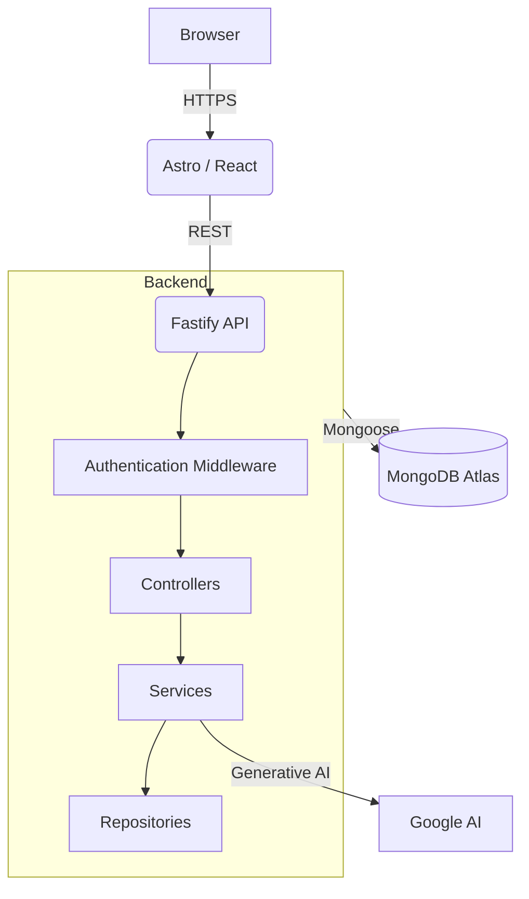

# CodeForge

A full-stack, production-ready portfolio and administrative platform designed to demonstrate modern software engineering practices.

> **Target:** A cohesive showcase of architecture, security, performance, and automation.

## Live Demo
[https://www.aesoul0.com](https://www.aesoul0.com)

## Screenshots
*(Insert Screenshots of Homepage, Project detail, Admin dashboard, Login, API playground, Mobile layout)*

## Architecture



## Key Engineering Decisions
See our Architecture Decision Records in `docs/adr/`:
- [001: Astro for Frontend](docs/adr/001-astro.md)
- [002: Fastify Backend](docs/adr/002-fastify.md)
- [003: JWT & Cookie Auth](docs/adr/003-jwt-cookie-auth.md)
- [004: AI Enrichment](docs/adr/004-ai-enrichment.md)

## Tech Stack
- **Frontend**: Astro, React, Tailwind CSS, TypeScript
- **Backend**: Node.js, Fastify, TypeScript, Mongoose
- **Database**: MongoDB Atlas
- **Testing**: Vitest, Supertest, Playwright

## Security
See [Security Architecture](docs/security.md).
- Fully configured CSP, Helmet, and CORS.
- Route-specific and global rate limiting.
- JWT authentication with secure, HttpOnly, SameSite=Strict cookies.
- No sensitive data exposed in the frontend or unauthenticated routes.

## Testing
- Backend unit and integration tests built with Vitest.
- E2E testing strategy using Playwright.
- Enforced coverage threshold via CI/CD (Target: >85%).

## Performance
- Dynamic Particle Canvas heavily optimized with `IntersectionObserver`, `requestAnimationFrame`, and `prefers-reduced-motion` adaptations.
- Zero-JS Astro islands wherever possible.
- Expected Lighthouse Scores: Performance ≥ 90, Accessibility 100, Best Practices 100, SEO 100.

## CI/CD
Automated GitHub Actions pipeline acting as a rigorous Quality Gate:
- Code linting and TypeScript typechecking
- Unit and integration tests (Vitest)
- E2E Tests (Playwright)
- CodeQL and Dependency audits

## API
- Fully documented via Swagger (`/docs` in dev).
- Secure API Playground available in the Admin Dashboard.
- Strict schema validation for all incoming DTOs.

## Environment Setup
See `.env.example` and `.env.test.example` in the `backend/` directory for configuring environments.

## Deployment
See [Deployment Strategy](docs/deployment.md).
- **Frontend**: Vercel (Server-Side Rendering)
- **Backend**: Render (Node.js)
- **Database**: MongoDB Atlas

## Observability
- Centralized `auditLogger` for critical domain events (e.g. `CREATE_PROJECT`, `LOGIN_ATTEMPT`).
- Environment-aware error handling (no stack traces in production).

## Project Structure
```text
CodeForge/
├── backend/       # Fastify REST API
├── frontend/      # Astro UI
├── docs/          # ADRs, Scorecards, Guidelines
├── scripts/       # Operational scripts
└── .github/       # CI/CD Workflows
```

## Roadmap
See [Professional 90/100 Roadmap](docs/roadmap.md).

## License
&copy; 2026 ÆSoul. All rights reserved.
This project and its source code are proprietary and belong exclusively to ÆSoul. Unauthorized copying, modification, or distribution is strictly prohibited.
